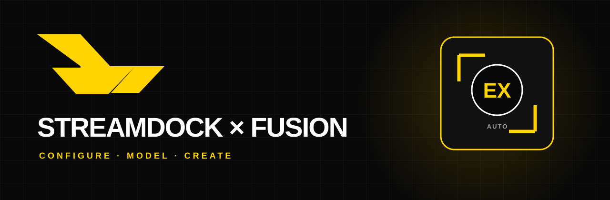
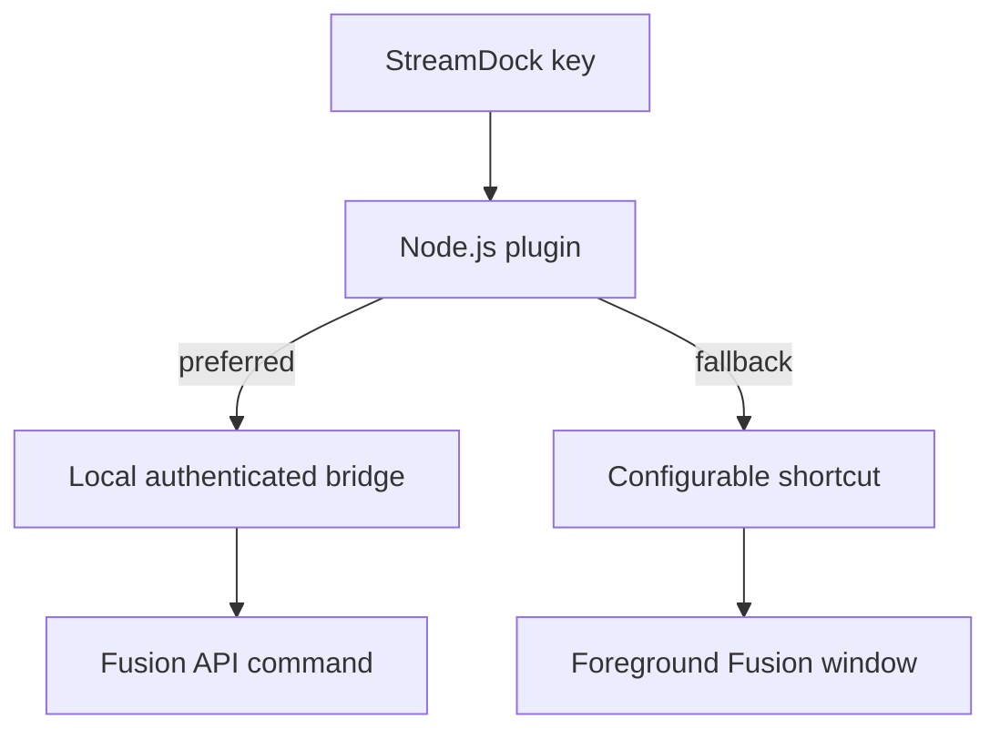

<p align="center"></p>

<p align="center"><strong>Configurable Autodesk Fusion controls for StreamDock on macOS and Windows.</strong><br><a href="docs/README.it.md">Italiano</a> · English</p>

> Early development scaffold. Software-only tests are available now; final device validation will follow on the MRSVI/StreamDock 293S.

## What it does

- One reusable **Fusion Command** action with 20 sketch, create, modify and inspect presets.
- Per-key execution mode: **Auto**, **Fusion API**, or **keyboard shortcut**.
- Editable command IDs and shortcuts; no hard-coded Autodesk installation paths.
- Optional Python bridge that runs inside Fusion and executes `CommandDefinition` objects on Fusion's main thread.
- Safe shortcut fallback that refuses to type unless Fusion is the foreground application.
- Dynamic, original Xtruza key artwork in `#FFD400` and `#080808`.
- A **Bridge Status** action for connection checks.

## Architecture



The StreamDock Plugin SDK owns device/app communication. The Device SDK is intentionally not included because this is an application plugin, not a custom hardware driver. See [Architecture](docs/ARCHITECTURE.md).

## Install

### StreamDock plugin

1. Download and unzip a release.
2. Copy `com.xtruza.streamdock.fusion360.sdPlugin` to:
   - macOS: `~/Library/Application Support/HotSpot/StreamDock/plugins/`
   - Windows: `%APPDATA%\HotSpot\StreamDock\plugins\`
3. Restart StreamDock.
4. Drag **Fusion Command** onto a key, open its Property Inspector, and choose a preset.

Shortcut mode works without the optional bridge. On macOS, grant Accessibility permission to StreamDock when macOS asks for it.

### Optional Fusion API bridge

Copy `fusion-addin/XtruzaStreamDockBridge` to Fusion's AddIns folder and enable **Run on Startup** in **Utilities → Scripts and Add-Ins**:

- macOS: `~/Library/Application Support/Autodesk/Autodesk Fusion/API/AddIns/`
- Windows: `%APPDATA%\Autodesk\Autodesk Fusion\API\AddIns\`

The add-in listens only on `127.0.0.1` and creates a random session token in `~/.xtruza/streamdock-fusion360/bridge.json`. The StreamDock plugin discovers this file, so it does not depend on Fusion's install path.

## Configure the three pages

Create StreamDock folders/pages for **Sketch**, **Create/Extrude**, and **Modify**. Add several copies of **Fusion Command** and select a different preset for each key. Page navigation remains a native StreamDock feature, which keeps profiles portable and avoids undocumented protocol calls.

Set the StreamDock profile/scene application to Autodesk Fusion. The plugin also protects shortcut execution by checking the foreground app.

## Test without hardware

```bash
cd streamdock-fusion360
npm run check
```

The runtime has no external npm dependencies: the package is ready to copy as-is. Tests validate the manifest, assets, localizations, local WebSocket framing, shortcut parsing, foreground-app matching, dynamic icons and Fusion add-in syntax. See [Testing](docs/TESTING.md) and the separate [hardware checklist](docs/HARDWARE-TESTS.md).

## Development status

- [x] SDK-conformant `.sdPlugin` scaffold
- [x] Configurable shortcut adapter for macOS and Windows
- [x] Optional authenticated Fusion API bridge
- [x] Property Inspector and dynamic key graphics
- [x] English and Italian documentation
- [x] Software-only validation and CI
- [ ] Verify native Fusion command IDs on current macOS Fusion build
- [ ] Validate key rendering, page navigation and latency on 293S
- [ ] Produce first signed release package

## Legal

This is an independent, unofficial open-source project by Xtruza. Autodesk and Fusion are trademarks of Autodesk, Inc. The project is not affiliated with or endorsed by Autodesk. StreamDock/Mirabox names belong to their respective owners. All project icons are original Xtruza artwork; no Autodesk product icons are redistributed.

Xtruza-authored material is released under the [MIT License](LICENSE). Bundled
open-source components retain their own notices; see
[Third-party notices](com.xtruza.streamdock.fusion360.sdPlugin/THIRD_PARTY_NOTICES.md).
